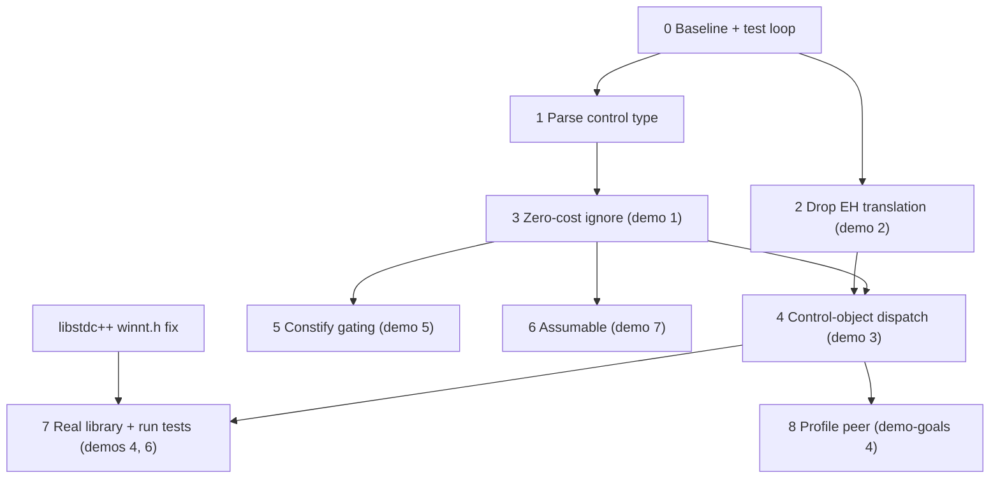

<!-- Companion to D4324_REFERENCE.md and demo-goals.md. The ordered, testable increment sequence for implementing the D4324 "Minimum Language, Maximum Library" contracts design on GCC. Each increment is one cc1plus build that adds one capability, paired with the test that proves it. -->

# D4324 Incremental Implementation Plan

## Purpose

This is the execution plan for implementing D4324 on GCC. It turns the "what exists" material in `D4324_REFERENCE.md` and the acceptance demos in `demo-goals.md` into an ordered sequence of small increments. Every increment produces a working `cc1plus` and adds exactly one capability that a test can exercise. The ordering front-loads the two headline results and isolates the riskiest work behind the cheapest possible tests.

Read `D4324_REFERENCE.md` for the extracted branch code and the per-area checklists it cites (Section 2 codegen, Section 3 parser and AST, Section 4 library, Section 5 flags and tests, Section 7 the area-ordered checklist). Read `demo-goals.md` for why each demo matters. This document is the sibling that says what to do first, second, and why.

## Ground rules that drive the ordering

Three facts shape the whole sequence.

- Branch from master, not from P3850. `d4324` forks upstream `master` (the P2900 baseline), and the P3850 branch is only a reference captured in `D4324_REFERENCE.md` (ref 7.1). The consequence is that most of the reference's delete list does not apply to us: we modify master's small `build_contract_check` (ref 2.2) and add one `<type-id>` parse, rather than stripping a 36,000-line superset. Increments stay small because the starting point is small.
- Keep early tests self-contained so they need only `cc1plus`. The compiler reads only the control type's member names and the call-operator signature (ref 2.3); it never needs the contents of `<contracts>`. So increments 1 through 6 can be tested with `dg-do compile` plus `scan-tree-dump`, where the test defines the tiny `std::contracts` enums and a control `struct` inline. This decouples the compiler work from the `libstdc++` build, which currently fails on this toolchain (a `C`-macro clash in MinGW's `winnt.h`) and would otherwise block every test. Only the run tests and the real header (increments 4-run, 7, 8) need `libstdc++`.
- Lead with the two properties that make the case alone. The reference names them (ref 7.1): a zero-cost `ignore` that emits no code, and a `noexcept` that keeps its meaning because no exception is translated. Both are cheap, both are independent of the rest, and both are headline demos, so they come first.

## The build and test loop

The compiler is already built once. Each increment is an incremental rebuild plus a test run. Run from an MSYS2/UCRT64 shell whose `PATH` includes `/c/msys64/ucrt64/bin` and `/c/msys64/usr/bin`.

Incremental compiler rebuild (roughly 2 to 3 minutes for a `cc1plus` change, since `all-gcc` skips the target libraries):

```bash
cd /c/Users/Vinnie/src/cursor/gnu_gcc/build
make -j$(nproc) all-gcc TMPDIR=/tmp TMP=/tmp TEMP=/tmp
```

Compile-only test of a single self-contained file with the freshly built C++ driver:

```bash
./gcc/xg++ -B./gcc/ -std=c++26 -fcontracts -fdump-tree-gimple -S test.C -o /dev/null
# inspect the emitted test.C.*t.gimple dump
```

Testsuite run once the D4324 tests exist under `gcc/testsuite/g++.dg/contracts/cpp26/`:

```bash
make check-gcc-c++ RUNTESTFLAGS="dg.exp=d4324-*.C"
```

Increments 1 through 6 use compile-only scans and do not need `libstdc++`. Increments that run a program (the demo 4 abort test) additionally need a working `libstdc++`, which means resolving the `winnt.h` build blocker first (tracked as a prerequisite of increment 7).

## Increment sequence

Each increment is one build of `cc1plus` followed by one test. Increments are numbered in recommended execution order.

### Increment 0 - Baseline and test loop

- Capability: a known-good starting point. `cc1plus` builds, and master's P2900 behavior is captured so later increments can be compared against it.
- Change: none to sources.
- Test: compile `int f(int x) pre(x > 0) { return x; }`. Under `-fcontract-evaluation-semantic=ignore` the gimple dump has no check; under `=enforce` it has the `__tu_has_violation` path. This confirms the `scan-tree-dump` loop works end to end.
- Reference: `gcc/c-family/c.opt` already defines `-fcontracts` and `-fcontract-evaluation-semantic=[ignore|observe|enforce|quick_enforce]` (default enforce).
- Demo mapping: demo 8 (the common syntax is unchanged) as the regression floor.
- Depends on: nothing.

### Increment 1 - Parse the optional control type

- Capability: `pre<T>(cond)`, `post<T>(r: cond)`, and `contract_assert<T>(cond)` parse, with the bare forms defaulting to `std::contracts::default_v`. The control type is stored on the AST node and is otherwise unused for now.
- Change: add `cp_parser_contract_control_type` to parse an optional `< type-id >` after the introducer; wire it into `cp_parser_contract_assert`, `cp_parser_function_contract_specifier`, and the `cp_maybe_function_contract_specifier` look-ahead (reuse the branch's angle-bracket depth walk). Expand the three contract tree codes and add `CONTRACT_CONTROL_TYPE` at operand 5. Extend `grok_contract` to store the control type; do not port P3400 facet validation, `allowed_mask`, or trampolines.
- Files: `gcc/cp/parser.cc`, `gcc/cp/cp-tree.def`, `gcc/cp/contracts.h`, `gcc/cp/contracts.cc` (`grok_contract`). Reference: 3.5 (parser additions), 3.7 (parser and AST checklist).
- Test: `dg-do compile` with `-fsyntax-only`. `pre<review>(x > 0)` and bare `pre(x > 0)` are both accepted; a malformed `pre<>(...)` is rejected. No codegen or library dependency.
- Demo mapping: prerequisite plumbing for demos 1, 3, 5, 7.
- Depends on: increment 0. Isolates the riskiest parser surgery (the `<` ambiguity against less-than) behind the cheapest test.

### Increment 2 - Drop exception-to-violation translation

- Capability: a `noexcept` function carrying a contract keeps `noexcept` true, and no exception-handling scaffolding is emitted around a predicate. A predicate exception propagates as an ordinary exception, stopped at the nearest `noexcept` boundary.
- Change: delete the `check_might_throw` try/catch block in master's `build_contract_check` (ref 2.9). No `_ex` entry point, no `CDM_EVAL_EXCEPTION`, no `__tu_has_violation_exception`. This is independent of increment 1 because it edits the codegen body, not the parser or AST.
- Files: `gcc/cp/contracts.cc` (`build_contract_check`). Reference: 2.9, 2.11.
- Test: demo 2, `d4324-noexcept-preserved.C`. On `int f(int x) noexcept pre(x > 0)`, `scan-tree-dump "eh_must_not_throw"` and `scan-tree-dump-not "CATCH"`.
- Demo mapping: headline demo 2.
- Depends on: increment 0. Can proceed in parallel with increment 1.

### Increment 3 - Zero-cost ignore via the control type

- Capability: an assertion whose control type reports `is_ignored(cfg) == true` emits no code and never evaluates its predicate, even when the translation-unit default is `enforce`. This is the compile-time residue only the compiler can provide.
- Change: introduce the minimal `evaluation_config` and `violation_response` enums (see the testing note on where they live). Repoint `ensure_evaluation_semantic` (keep it as the single resolution choke point, ref 2.4) so its body reads `T::is_ignored(cfg)` as a constant expression and caches the resolved `cfg` and control type on the node instead of a `CES_*` value. In `build_contract_check` step 1, emit nothing when `is_ignored` folds to true. Delete the P3595 config resolution used only for codegen semantics.
- Files: `gcc/cp/contracts.cc` (`ensure_evaluation_semantic`, `build_contract_check`). Reference: 2.4, 2.11, and the three-step algorithm (ref 2.2, D4324 mapping).
- Test: demo 1, `d4324-ignore-zero-cost.C`. `scan-tree-dump-not "__cxa_contract_violation"`, the predicate call is absent, and there is no `eh_` scaffolding. The control object is defined inline in the test.
- Demo mapping: headline demo 1. Brings the resolution infrastructure online for the increments that follow.
- Depends on: increment 1 (needs the control type on the node).

### Increment 4 - Control-object dispatch call

- Capability: on a violation the compiler makes exactly one runtime call, `T::operator()(comment, loc, cfg)`, and branches on the returned `violation_response`: contract-terminate on `terminate`, continue on `proceed`. This replaces master's built-in `__tu_has_violation` semantic switch.
- Change: rewrite `build_contract_check` step 3 to build the single call and the two-way branch, passing the predicate text as `comment` and a `std::source_location` as `loc`. Delete the violation-constant construction and the `__tu_has_violation` call. Keep the `cp-gimplify.cc` genericization hook and `view_as_const` unchanged (ref 2.11 keep list).
- Files: `gcc/cp/contracts.cc` (`build_contract_check`). Reference: 2.2 (D4324 mapping), 2.11.
- Test: demo 3, `d4324-review-user-semantic.C`. `scan-tree-dump "review.*cl"` shows a call to the user's `operator()` rather than a hard-coded semantic. Self-contained (control object inline). The `dg-do run` terminate-after-handler test (demo 4) is stubbed here and completed in increment 7, once the library and runtime are real.
- Demo mapping: headline demo 3. This is the core of the design.
- Depends on: increment 3 (resolution infrastructure) and increment 2 (an exception-free call path).

### Increment 5 - Constify gating

- Capability: by default a predicate binds the same overload the function body would, so there is no silent divergence under overload resolution. Naming a control type whose `constify` is true restores constification for the assertions that name it.
- Change: gate `constify_contract_access` on the resolved control type's compile-time `constify` member (default false), keeping the P3098 capture exemption. Resolve the ordering concern: the control type must be known at the point constification runs (constification currently happens during name lookup), so either resolve the control type early for this purpose or defer constification into codegen step 2 (ref 2.8, 2.11).
- Files: `gcc/cp/semantics.cc`, `gcc/cp/pt.cc`, `gcc/cp/contracts.cc`. Reference: 2.8, 2.11.
- Test: demo 5. A predicate over a const and non-const overload set binds the body's overload by default; opting in with a `constify`-true control restores the const overload. `scan-tree-dump` for the selected callee.
- Demo mapping: demo 5 (constification off by default).
- Depends on: increment 3.

### Increment 6 - Assumable predicate

- Capability: a guaranteed-enforced control type whose `assumable` is true lets the optimizer treat an ignored predicate as an assumption, so a downstream operation can be simplified.
- Change: in `build_contract_check` step 1, when `T::is_ignored(cfg)` and `T::assumable` are both true, emit an optimizer assumption (unreachable on negation of the predicate) instead of nothing (ref 2.2 step 1, 2.11).
- Files: `gcc/cp/contracts.cc` (`build_contract_check`). Reference: 2.2, 2.11.
- Test: demo 7. `pre<mandatory>(x > 0)` at the ignore configuration lets the optimizer drop a later bounds check; scan the optimized dump for the eliminated check.
- Demo mapping: demo 7 (guaranteed-enforced `mandatory` is assumable).
- Depends on: increment 3 (the ignore path).

### Increment 7 - Real library surface and run tests

- Capability: the demos build against the real `<contracts>` header instead of inline definitions, and programs run: a terminating semantic aborts after the handler returns, and a `review` control logs and continues.
- Change: add `evaluation_config`, `violation_response`, the `assertion_control` concept, and `default_control`, `review`, and `mandatory` to `libstdc++-v3/include/std/contracts`, reusing the existing P2900 `contract_violation` and `handle_contract_violation` / `invoke_default_contract_violation_handler` (ref 4.7, 4.8). Migrate the increment 3 to 6 tests from inline definitions to `#include <contracts>`.
- Prerequisite: fix the `libstdc++` build blocker (the `C`-macro clash in MinGW's `winnt.h`) so `dg-do run` works. That prerequisite is independent of the compiler work and can be tackled at any time before this increment.
- Files: `libstdc++-v3/include/std/contracts`, `libstdc++-v3/src/experimental/contract26.cc`, the test files. Reference: 4.7, 4.8.
- Test: demo 4 run test `d4324-handler-no-ub.C` (SIGABRT after the handler returns, must not reach `main`'s return), and demo 6 (`review` logs and continues at observe, `mandatory` terminates).
- Demo mapping: demos 4 (run) and 6.
- Depends on: increment 4 (the call shape is final) and the `libstdc++` build fix.

### Increment 8 - Contracts and a profile as independent peers

- Capability: an author-written `pre(cond)` routes through its control object while a core-language-UB check routes through a separate, independently owned path. Replacing the contract handler changes the contract response but leaves the UB-check response unchanged.
- Change: add a minimal `std::core_ub`-style check in a second header whose response does not route through the contract-violation handler (a stub that terminates on its own path is enough to show the wiring). Reference: `demo-goals.md` demo 4 and paper Section 4.
- Files: a new library header (peer to `<contracts>`), a test.
- Test: swap `handle_contract_violation`; assert the contract response changes and the UB-check response does not.
- Demo mapping: demo 4 from `demo-goals.md` (contracts and a profile as independent peers).
- Depends on: increment 4 (a stable contracts path).

## Dependency and parallelism graph



Increments 1 and 2 are independent (parser and AST versus the `build_contract_check` try/catch) and may run in parallel. Increments 5 and 6 both depend only on increment 3 and are mutually independent, since they touch different codegen aspects (constification in name lookup or step 2, assumption emission in step 1); they share `contracts.cc`, so serializing them avoids merge friction. The `libstdc++` fix is independent of the compiler work and can proceed at any time before increment 7.

## Notes and decisions

- Naming to reconcile at increments 3 and 4. The reference's demo tests (ref 5.9) spell `pre<std::contracts::ignore>` and `pre<enforce>`, naming fixed-semantic control objects, while the paper's Appendix A uses `default_v` plus a translation-unit `cfg`. The library should provide both: the `cfg`-driven `default_v` and fixed-semantic control objects (`ignore`, `enforce`, `review`, `mandatory`) so the demo tests read as written and the paper's model still holds. Confidence: medium, since it is settled by the library surface and does not affect the compiler algorithm.
- Where the `evaluation_config` enum lives for early tests. The compiler must materialize a `cfg` value to pass to `is_ignored` and `operator()`, so it needs the enum type in scope. For increments 3 to 6 the self-contained tests define `namespace std::contracts { enum class evaluation_config ... }` themselves, so no `libstdc++` header is required. Increment 7 moves to the real header. Confidence: high.
- Keep increments 3 and 4 separate. Merging the two halves of the codegen rewrite (step 1 ignore, step 3 dispatch) would collapse two testable milestones (demo 1, then demo 3) into one. Keeping them apart matches the minimum-change-to-a-test goal. Confidence: high.
- Do not port the P3850 machinery. The config engine, descriptor-chain ABI, `libcontracts`, the entry-point matrix, the `_noexcept` wrappers, the P3400 label facets, and the per-paper flag zoo are all out of scope (ref 7.3 delete list). Starting from master means most of these never exist in our tree to begin with.

---

*2026-07-18 15:46 - Opus 4.8*

